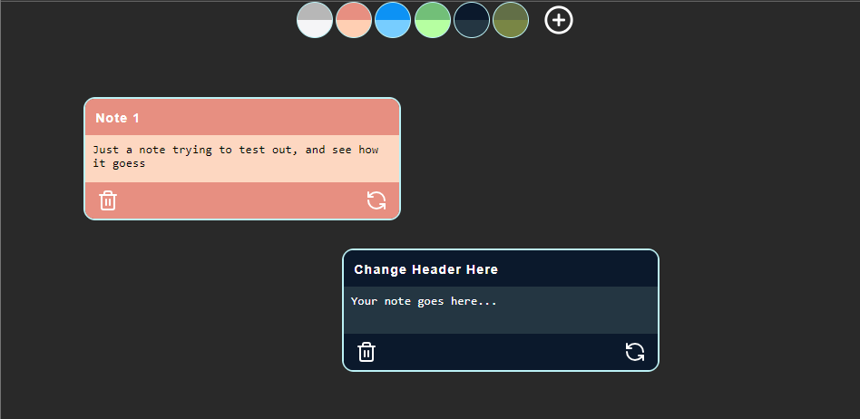

# Draggable Note

Draggable Note is a simple, interactive web application that allows users to create, update, edit, and delete notes with customizable color palettes. The notes can be dragged around the screen for flexible arrangement, providing a dynamic user experience.


## Features

* **Create Notes** : Add new notes with a title and body.
* **Edit Notes** : Modify the content of existing notes, including the title and body.
* **Delete Notes** : Remove notes with a simple action.
* **Draggable Notes** : Each note can be dragged around the screen, offering a customizable layout.
* **Color Palette Customization** : Users can change the color of each note from a selection of palettes to better organize and visually distinguish notes.
* **LocalStorage Persistence** : Notes and their positions are stored in the browser’s LocalStorage, ensuring data is maintained even after refreshing the page.

## Technologies Used

* **React** : For building the user interface.
* **Vite** : As the build tool for development and production.
* **LocalStorage** : To store the notes and their metadata locally in the browser.

## Project Structure

```
├── node_modules/
├── public/
├── src/
│   ├── assets/
│   ├── components/
│   │   ├── ColorPalette.jsx
│   │   ├── ColorPalettes.jsx
│   │   ├── Input.jsx
│   │   ├── NoteCard.jsx
│   │   ├── TextArea.jsx
│   ├── context/
│   │   ├── NoteContext.jsx
│   ├── database/
│   │   └── color-theme.json
│   ├── Icons/
│   │   ├── AddIcon.jsx
│   │   ├── DeleteIcon.jsx
│   │   ├── SavingIcon.jsx
│   ├── pages/
│   │   └── NotePage.jsx
│   ├── services/
│   │   └── localStorageService.js
│   ├── utils/
│   │   ├── _helpers.js
│   │   ├── _storage-helper.js
│   │   └── _constants.js
│   ├── App.jsx
│   ├── index.css
│   ├── main.jsx
├── .gitignore
├── eslint.config.js
├── index.html
├── package.json
├── README.md
├── vite.config.js

```


### Main Components

* **NoteCard** : Displays individual notes with draggable functionality.
* **ColorPalettes** : Allows the user to select different colors for each note.
* **NoteContext** : Provides global state management for the notes.
* **localStorageService** : Manages interactions with the LocalStorage API for persistent data storage.

## How to Run Locally

1. **Clone the Repository:**

```
git clone https://github.com/fm-durodola/draggable-note.git
cd draggable-note
```

2. Install Dependencies:

```
npm install
```

3. Run the Development Server:

```
npm run dev
```

4. **Build for Production:**

```
npm run build
```

5. Preview the Production Build:

```
npm run preview
```

## Future Improvements

* **User Authentication** : Add the ability to store and retrieve notes for specific users using a backend.
* **Note Search** : Implement a search functionality for easier navigation through notes.
* **Categories/Tags** : Allow users to categorize and tag notes for better organization.

## License

This project is open source and available under the [MIT License]().
